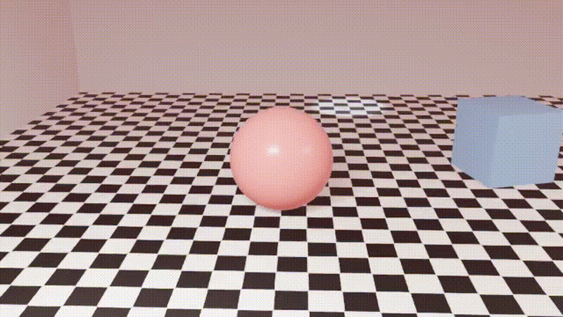

# Wallermax H1



> **⚠️ BETA PROTOTYPE — NOT PRODUCTION-READY**
>
> Wallermax H1 is a **beta prototype** of a **video generator based on 3D scene
> rendering**. It is an experimental project that demonstrates how a Large Language
> Model (LLM) can be used to translate a natural-language description — optionally
> accompanied by reference and look-dev images — into a fully procedural 3D
> animation rendered as an MP4 video.
>
> The core idea: **send all available context (prompt, images, render settings) to
> an LLM via its API, receive a structured JSON "World Model" that describes every
> object, light, camera and event in the scene, then feed that JSON to a Python
> script that drives Blender (or any other 3D modeling application with a Python
> API) to produce the animation.**

---

## Table of contents

1. [What it does](#what-it-does)
2. [Why a fallback renderer?](#why-a-fallback-renderer)
3. [Highlights vs. World Compiler v2 / v3](#highlights-vs-world-compiler-v2--v3)
4. [Quick start](#quick-start)
5. [Project layout](#project-layout)
6. [The three analyzers](#the-three-analyzers)
7. [Renderers](#renderers)
8. [PBR textures (NEW in v1.0.1)](#pbr-textures-new-in-v101)
9. [Texture Atlas (NEW in v1.1.0)](#texture-atlas-new-in-v110)
10. [Camera behaviors](#camera-behaviors)
11. [Configuration](#configuration)
12. [HTTP API](#http-api)
13. [CLI](#cli)
14. [Web UI](#web-ui)
15. [Examples](#examples)
16. [Troubleshooting](#troubleshooting)
17. [Changelog](#changelog)
18. [License](#license)

---

## What it does

Given a text prompt and (optionally) up to two images, Wallermax H1
produces an MP4 video of a procedurally generated 3D scene.

```
                 ┌───────────────────┐
   prompt ─────► │                  │
                 │   Wallermax H1   │
   reference ─► │     server       │ ────► render.mp4
   image        │  (TypeScript +    │       world.json
   (optional)   │   Python)        │       scene_report.md
                 │                  │       reconstruction.json
   final/target ─►│                  │       final_image.json
   image        └─────────┬─────────┘
   (optional)             │
                           ▼
                  ┌─────────────────────┐
                  │   Blender           │  ← if installed
                  │   (python/build_    │     → world.blend + render.mp4
                  │    scene.py)        │
                  └─────────────────────┘
                           │
                           │ if Blender is NOT installed
                           ▼
                  ┌─────────────────────┐
                  │  Fallback renderer  │  ← always available
                  │  (python/fallback_  │     → render.mp4 + poster.png
                  │   renderer.py)      │     (top-down schematic preview)
                  └─────────────────────┘
```

The reference image is used to **reconstruct** the visible 3D scene (rooms,
objects, materials, lighting). The final image is used as a **look-dev
target** — the system extracts its camera language, lighting mood, palette,
objects and textures, then folds them into the World Model's `aesthetic`
block so the rendered MP4 visually matches the target.

Every entity in the World Model carries a `provenance` field
(`observed` / `user_defined` / `inferred` / `creative`) and a `confidence`
float. The system never silently turns a creative guess into a fact.

## Why a fallback renderer?

Blender is a heavyweight native dependency (200+ MB, requires a GPU or
CPU rendering license, OS-specific installers, etc.). It is not always
available — especially in:

- Sandboxed or containerized environments (CI, Docker, online IDEs).
- Demo / evaluation machines where the user just wants to see the
  pipeline working before installing Blender.
- Headless servers without a GUI.

Wallermax H1 ships with a **fallback preview renderer**
(`python/fallback_renderer.py`) that uses only Pillow and ffmpeg to
produce an MP4. It is **not** a substitute for Blender — it produces a
top-down schematic / look-dev preview that visualizes the room, the
entities, the lights (as colored glows), the camera, and the animated
events. It also applies the aesthetic block (vignette, grain, exposure,
bloom) so you can preview the look-dev.

The fallback is invoked **automatically** when Blender is not on PATH
(or fails to start). The job is marked `done` with
`renderEngine: "fallback"`, and the web UI shows a clear badge so the
user knows what happened.

## Highlights vs. World Compiler v2 / v3

Wallermax H1 is a unified, improved rewrite of the World Compiler v2
prototype and the v3 reconstruction block. It keeps the proven semantic
approach (a small declarative *World Model* JSON is what the renderer
consumes, never raw mesh data) and adds significant new functionality.

| Concern | v2 / v3 | **Wallermax H1** |
| --- | --- | --- |
| Orchestration language | Python | **TypeScript (native Node.js)** |
| LLM calls | `openai` Python SDK | `openai` Node SDK **+ ZAI SDK + Mock + DeepSeek** (provider-agnostic) |
| Web UI | none | **Built-in dark-mode web UI** (HTML/CSS/JS, no React) |
| Reference image | ✓ (single) | ✓ (reconstruction schema) |
| **Final / target image** | — | ✅ **NEW**: extracts camera, lighting, palette, objects, textures |
| Aesthetic block | — | ✅ `world.aesthetic` drives ambient color, vignette, bloom, exposure |
| **PBR image textures** | — | ✅ **NEW in v1.0.1**: `texture_image`, `normal_image`, `roughness_image` |
| Camera behaviors | look_at, orbit | + dolly_in/out, crane_up/down, pan, tilt, DoF |
| Materials | solid + checker | + noise, gradient, brick, emission, alpha, IOR, **image textures** |
| Lights | color only | + color temperature (Kelvin → sRGB) |
| Render engine | EEVEE_NEXT only | EEVEE_NEXT **or** Cycles |
| Provenance / confidence | ✓ | ✓, also stamped as Blender custom properties |
| Job system | — | in-memory jobs + SSE live progress |
| **Fallback renderer** | — | ✅ **NEW**: produces MP4 even without Blender |
| CLI | `main.py` | `npm run cli` |
| Blender script | Python | Python (Blender's API is Python-only) |

The Python layer is intentionally minimal: it now contains **two**
scripts. `python/build_scene.py` is the full Blender compiler.
`python/fallback_renderer.py` is the preview renderer. All LLM, schema,
validation, job orchestration and HTTP work happens in TypeScript.

## Quick start

```bash
# 1. Install dependencies
cd wallermax-h1
npm install

# 2. Configure (defaults work out-of-the-box with the mock provider)
cp .env.example .env

# 3. Start the dev server (hot reload via tsx watch)
npm run dev
```

Then open **http://127.0.0.1:4317/** in your browser.

You should see the dark-mode Wallermax UI. Pick the **mock** provider,
leave the prompt as the default checkerboard-room example, uncheck
"Skip Blender" if Blender is installed (or leave it checked to only
produce the World Model JSON), and hit **Run pipeline**. You'll get a
`render.mp4` (real 3D if Blender is installed, preview otherwise) and a
full set of analysis JSON files.

### Run from the CLI (no web UI)

```bash
# Mock-only (no API key needed). Will try Blender, then fallback.
npm run cli -- --prompt prompts/example.txt --provider mock

# Mock + skip Blender entirely (World Model only, no MP4):
npm run cli -- --prompt prompts/example.txt --provider mock --skip-blender

# Full pipeline with OpenAI + reference + final image:
npm run cli -- --prompt prompts/example.txt --provider openai \
  --image reference.png --final target.jpg

# Full pipeline with ZAI (sandbox):
npm run cli -- --prompt prompts/example.txt --provider zai

# Full pipeline with DeepSeek (text-only LLM, no vision):
npm run cli -- --prompt prompts/textures_example.txt --provider deepseek
```

The CLI uses the exact same renderer abstraction as the web server: if
Blender is on PATH it runs `python/build_scene.py`; otherwise it runs
`python/fallback_renderer.py` and prints a clear notice.

### Production build

```bash
npm run build         # tsc -> dist/
npm run serve         # node dist/server/src/index.js
```

## Project layout

```
wallermax-h1/
├── package.json
├── tsconfig.json
├── .env.example
├── .gitignore
├── README.md
│
├── server/                       # Native Node.js + TypeScript
│   └── src/
│       ├── index.ts              # HTTP server entry
│       ├── router.ts             # Minimal route dispatcher
│       ├── config.ts             # .env loader, paths, defaults
│       ├── types.ts              # Shared types
│       ├── util.ts               # sendJson, readBody, mime, etc.
│       ├── jobs.ts               # In-memory job store + listeners
│       ├── pipeline.ts           # Orchestrates analyze → compile → render
│       ├── renderer.ts           # Renderer abstraction (Blender + fallback)
│       ├── cli.ts                # CLI entry point (npm run cli)
│       ├── cli/report.ts         # CLI report builder
│       ├── llm/
│       │   ├── index.ts          # Provider factory
│       │   ├── provider.ts       # Interface + JSON extractor
│       │   ├── prompts.ts        # System prompts
│       │   ├── openai.ts         # OpenAI provider (Chat Completions JSON mode)
│       │   ├── zai.ts            # ZAI provider (z-ai-web-dev-sdk)
│       │   ├── deepseek.ts       # DeepSeek provider (text-only, OpenAI-compatible)
│       │   └── mock.ts           # Canned-data provider (no API key needed)
│       ├── analyzers/
│       │   ├── schemas.ts        # JSON schema loader
│       │   ├── scene.ts          # Unified scene analyzer (prompt + ref + final)
│       │   └── finalImage.ts     # Standalone final-image analyzer
│       └── handlers/
│           ├── index.ts          # Route handlers (health, jobs, pipeline…)
│           └── multipart.ts      # formidable wrapper
│
├── public/                       # Web UI (vanilla HTML/CSS/JS)
│   ├── index.html
│   ├── styles.css
│   └── app.js
│
├── python/                       # Renderer backends (Python only)
│   ├── build_scene.py            # Full Blender compiler (PBR textures supported)
│   ├── fallback_renderer.py      # Fallback preview renderer (PIL + ffmpeg)
│   └── README.md
│
├── schemas/                      # JSON schemas (shared between LLM and Python)
│   ├── world_model.schema.json   # v1.0.1: PBR textures + behavior.distance + room.target
│   ├── reconstruction.schema.json
│   └── final_image.schema.json   # Final-image / look-dev analysis
│
├── prompts/
│   ├── example.txt                # Text-only example (from v2)
│   ├── reconstruction_example.txt# Image + prompt example (from v3)
│   ├── cinematic_dusk.txt        # Cinematic look-dev example
│   └── textures_example.txt      # NEW v1.0.1: PBR textures with text-only LLM
│
├── docs/
│   ├── architecture.md
│   ├── api.md
│   └── textures.md               # NEW v1.0.1: PBR textures guide
│
└── download/                     # Reserved for user-facing downloads
```

## The three analyzers

When the user supplies **prompt + reference image + final image**, the
pipeline issues **three** LLM calls in sequence, then renders:

1. **Reconstruction** — feeds the reference image to the LLM with the
   `reconstruction.schema.json` schema. Produces a structured hypothesis
   of the visible 3D scene (entities, lighting, camera, ambiguities).
   Conservative: preserves confidence and provenance instead of pretending
   a single image uniquely determines the scene.

2. **Final-image analysis** — feeds the final image to the LLM with the
   `final_image.schema.json` schema. Produces an aesthetic / look-dev
   description (camera language, lighting mood, palette, objects,
   textures). Aesthetic, not geometric.

3. **Scene compiler** — feeds the prompt + reconstruction JSON +
   final-image JSON to the LLM with the `world_model.schema.json` schema.
   Produces the single World Model that the renderer consumes. This is
   the only call that always runs, even when no images are supplied.

The reconstruction and final-image analyses are kept as separate JSON
files (`reconstruction.json`, `final_image.json`) so the user can inspect
them in the web UI's tabs.

### Why three calls instead of one?

Because they have different jobs:

- The reconstruction needs to be **conservative** (preserve confidence,
  flag ambiguities). Letting it leak into the scene compiler would blur
  provenance.
- The final-image analysis is **aesthetic**, not geometric. Folding it
  into the scene compiler would risk the model "copying" geometry from
  the target image.
- Keeping them separate lets the user override either one independently
  (e.g. feed a reconstruction without a final image, or vice versa).

### Provenance flow

Every entity in the World Model carries `provenance` ∈
{`observed`, `user_defined`, `inferred`, `creative`} and a `confidence`
float. The Blender compiler preserves these as Blender custom properties
on each object, so they survive into the `.blend` file and can be
inspected in Blender's UI.

### Provider abstraction

`server/src/llm/provider.ts` defines a minimal interface:

```ts
interface LLMProvider {
  readonly name: string;
  analyze(options: AnalyzeOptions): Promise<AnalyzeResult>;
}
```

Adding a new provider (Anthropic, a local Llama, …) means implementing
that interface and adding a case to the factory in `llm/index.ts`. The
shared `extractJson()` helper tolerates fenced JSON, leading prose and
unbalanced-fence responses, so providers that don't natively support
JSON-schema-strict output still work.

### Mock provider

The `MockProvider` returns canned but realistic payloads for all three
schemas. It is **deterministic** (same inputs → same outputs) so the
resulting render is reproducible. It lets you exercise the entire
pipeline (and the web UI) without an API key — perfect for demos and CI.

### DeepSeek provider (text-only)

The `DeepSeekProvider` is a thin wrapper around the OpenAI-compatible
DeepSeek API (model `deepseek-chat`). It uses the **Chat Completions**
endpoint with JSON mode and `temperature: 0.2`. **DeepSeek does not
support image inputs**, so:

- Calls 1 (reconstruction) and 2 (final-image analysis) are **skipped
  automatically** when DeepSeek is the provider and images are supplied.
- Only Call 3 (scene compiler) runs. The system annotates the prompt
  with the **filenames** of the uploaded images (e.g.
  `[Uploaded image #1: filename="wood.jpg"]`) so the LLM can still
  emit `material.texture_image: "wood.jpg"` even though it cannot see
  the image pixels.
- The compiler's `resolveTextureName()` post-processor then resolves
  those bare filenames to the absolute upload paths on disk before
  passing the World Model to Blender.

This means **text-only LLMs can still drive PBR-textured scenes** —
the user just has to mention the filenames explicitly in the prompt
("apply texture 'wood.jpg' to the floor").

## Renderers

Wallermax H1 has **two** renderer backends. The TypeScript orchestrator
(`server/src/renderer.ts`) abstracts them behind a single `render()`
function that tries Blender first and falls back gracefully.

### 1. Blender (`python/build_scene.py`)

The "real" renderer. Produces a `.blend` file and an MP4 with full PBR
materials, real rigid-body physics, perspective camera with depth-of-field,
and the aesthetic compositor pass (vignette / bloom / exposure).

Requirements:

- Blender 3.6+ (4.x recommended) installed and on PATH (or pointed to by
  `BLENDER_BIN`).
- Blender's bundled Python (no extra Python packages needed inside
  Blender — `build_scene.py` only uses `bpy`, `mathutils` and the
  standard library).

Outputs:

- `world.blend` — the saved Blender scene.
- `render.mp4` — the rendered MP4 (H.264, EEVEE_NEXT or Cycles).

See `python/README.md` for the full feature list and the differences
vs. World Compiler v2.

### 2. Fallback preview renderer (`python/fallback_renderer.py`)

Used **automatically** when Blender is not installed, fails to start,
or when the user explicitly requests it. It produces a top-down
schematic / look-dev preview using only Pillow and ffmpeg.

What it renders:

- The room as a checkerboard floor + walls outline (top-down view).
- Each entity as a colored 2D disk / box / cylinder icon at its X, Y
  position.
- Lights as colored radial glows (size and brightness derived from the
  `power` field; color derived from `color` or `color_temperature_k`).
- The camera as a small triangle.
- Animated events: position changes, energy changes, color changes are
  all keyframed over time.
- The aesthetic block: vignette, film grain, exposure EV are applied as
  a final compositor pass.

Requirements:

- Python 3.10+
- Pillow (`pip install Pillow`)
- numpy (`pip install numpy`)
- ffmpeg on PATH

Outputs:

- `render.mp4` — H.264 MP4 (same codec as Blender's output).
- `poster.png` — the first frame, useful as a static thumbnail.

The fallback is intentionally **deterministic**: same inputs → same
outputs. It does not honor real physics, BRDFs, perspective camera or
complex materials — those require Blender.

### How the choice is made

The `render()` function in `server/src/renderer.ts` does the following:

1. If `forceFallback` is `true`, skip Blender entirely and use the
   fallback.
2. Otherwise, check if Blender is on PATH (or at the path pointed to by
   `BLENDER_BIN`). If yes, run `python/build_scene.py` via
   `blender -b --python …`.
3. If Blender is not on PATH, or if it fails to start, log a clear
   notice and run `python/fallback_renderer.py` via `python3 …`.

The job's `renderEngine` field is set to `"blender"` or `"fallback"` so
the web UI and the API consumers can tell which renderer was used.

## PBR textures (NEW in v1.0.1)

Starting with **v1.0.1**, the World Model supports **PBR image textures**.
The `material` block of any entity can now carry:

```jsonc
{
  "material": {
    "base_color": [1, 1, 1, 1],            // white multiplier when a texture is used
    "roughness": 0.6,
    "metallic": 0.0,
    "texture_image":  "wood.jpg",            // albedo map (sRGB)
    "normal_image":   "wood_normal.png",     // tangent-space normal map (Non-Color)
    "roughness_image":"wood_roughness.png",  // grayscale roughness map (Non-Color)
    "normal_strength": 1.0,                  // optional, default 1.0
    "pattern_scale": 4.0                     // tiling (4.0 = 4×4 repeats across UV)
  }
}
```

The Blender compiler (`python/build_scene.py:make_material`) creates the
appropriate shader nodes (`ShaderNodeTexImage`, `ShaderNodeNormalMap`,
`ShaderNodeMapping`, `ShaderNodeUVMap`) and connects them to the
Principled BSDF. Color spaces are set correctly:
**sRGB** for `texture_image`, **Non-Color** for `normal_image` and
`roughness_image`.

### Texture resolution

When a texture filename is emitted by the LLM (e.g. `"wood.jpg"`), the
TypeScript orchestrator (`server/src/analyzers/scene.ts`) tries to
resolve it to the absolute upload path on disk. The resolution strategy,
in order:

1. **Exact match** on the uploaded filename (e.g. the LLM emits
   `"1787229211108-wood.jpg"` and the upload is named exactly that).
2. **Basename match** (the LLM may strip the directory part).
3. **Suffix match** — the upload name **ends with** the LLM-emitted
   name. This handles the case where the server renames uploads with
   a timestamp prefix (e.g. upload `"1787229211108-wood.jpg"` matches
   the LLM's `"wood.jpg"`).
4. **Case-insensitive suffix match** (Windows-friendly).
5. **Absolute path or URL** — if the LLM emits a path starting with
   `/`, `http`, or a Windows drive letter (`C:\`), it is used as-is.

If resolution fails, the compiler logs
`WALLERMAX_TEXTURE_RESOLVE_FAIL` and the render continues with the
base color instead of the texture.

### How to use textures with a text-only LLM (no vision)

DeepSeek, Llama-3-text, and similar LLMs **cannot see images**. To use
PBR textures with them, follow this recipe:

1. **Upload the images with simple, predictable filenames** from the
   web UI. The server will rename them with a timestamp prefix
   (e.g. `1787229211108-wood.jpg`), but the **original filename** you
   chose is what the LLM will use to reference the image.

2. **Mention the filenames explicitly in the prompt**. Example:

   ```text
   Create a 6×3×6 m cubic room centered at the origin.
   Apply the texture 'wood.jpg' (uploaded as referenceImage) to the floor.
   Apply the texture 'brick.jpg' (uploaded as finalImage) to the walls.
   Use type:"room" with metadata.floor_material and metadata.wall_material
   to assign them. Use pattern_scale 3.0 for the floor and 2.0 for the walls.
   ```

3. The orchestrator **annotates the prompt** sent to the LLM with the
   filenames of the uploaded images:

   ```
   --- Uploaded images (use these filenames verbatim when emitting
       material.texture_image / normal_image / roughness_image) ---
     [Uploaded image #1: filename="1787229211108-wood.jpg"]
     [Uploaded image #2: filename="1787229211108-brick.jpg"]
   ```

4. The LLM emits `material.texture_image: "wood.jpg"` (the name it
   parsed from your prompt). The orchestrator's `resolveTextureName()`
   resolves it to the absolute upload path via the suffix-match
   strategy (#3 above).

5. Blender receives the absolute path and loads the texture via
   `bpy.data.images.load()`. Look for `WALLERMAX_TEXTURE_APPLIED` in
   the logs to confirm.

### Room entities: floor vs wall materials

For `type:"room"` entities, the compiler reads textures from
`metadata.floor_material` and `metadata.wall_material` (separate
materials for the floor and the four walls). Both can be either a
string (treated as `{"texture_image": <string>}`) or a full material
spec:

```jsonc
{
  "id": "room",
  "type": "room",
  "geometry": { "dimensions": [6, 6, 3] },
  "metadata": {
    "floor_material": {
      "texture_image": "wood.jpg",
      "pattern_scale": 3.0,
      "roughness": 0.6
    },
    "wall_material": {
      "texture_image": "brick.jpg",
      "pattern_scale": 2.0,
      "roughness": 0.8
    },
    "checker_tile_size": 0.25,
    "wall_thickness": 0.15
  }
}
```

If `floor_material` or `wall_material` is omitted, the compiler falls
back to the procedural checker material (floor) and a neutral solid
color (walls) — same behavior as v1.0.0.

### Defensive string handling

Some text-only LLMs occasionally emit `material` as a bare string
instead of an object (e.g. `"material": "wood.jpg"` instead of
`"material": {"texture_image": "wood.jpg"}`). The compiler now coerces
any string-shaped material spec into `{"texture_image": <string>}` so
the render never crashes with `AttributeError: 'str' object has no
attribute 'get'`.

### Limitations

- Only `albedo`, `normal`, and `roughness` maps are supported. Ao and
  metallic maps are easy to add by following the same pattern.
- No automatic image resizing — Blender loads the image at its native
  resolution. For 8K+ textures, consider pre-resizing with Pillow.
- UVs are not explicitly unwrapped. The compiler relies on the default
  UVs of `primitive_*_add` operators, which work for `plane` and `box`
  but may look distorted on complex meshes.
## THE NEW SECTION CONTENT (copy everything below this line)

## Texture Atlas (NEW in v1.1.0)

A **texture atlas** is a single PNG image containing a grid of smaller texture
tiles. Wallermax H1 lets you compose your own custom atlas by selecting tiles
from predefined atlases, and then reference them by coordinates in your prompts.
This is the recommended way to apply textures when using text-only LLMs like
DeepSeek, since it doesn't require uploading individual image files.

### What's a texture atlas?

A texture atlas is a single PNG (typically 1024×1024 px) divided into a grid
of smaller tiles (typically 10×10 grid of 102×102 px tiles, so 100 tiles per
atlas). Instead of uploading 100 separate image files, you upload 1 atlas
and reference tiles by their `(row, col)` coordinates.

```
┌────┬────┬────┬────┬────┬────┬────┬────┬────┬────┐
│0,0 │0,1 │0,2 │0,3 │0,4 │0,5 │0,6 │0,7 │0,8 │0,9 │  ← row 0
├────┼────┼────┼────┼────┼────┼────┼────┼────┼────┤
│1,0 │1,1 │1,2 │...                              │  ← row 1
├────┼────┼────┼────┼────┼────┼────┼────┼────┼────┤
│2,0 │2,1 │2,2 │...                              │  ← row 2
├────┴────┴────┴────┴────┴────┴────┴────┴────┴────┤
│ ... (more rows) ...                            │
└────────────────────────────────────────────────┘
  ↑    ↑    ↑
  col  col  col
  0    1    2
```

### Predefined atlases

Wallermax H1 ships with 4 predefined atlases in `assets/texture_atlas/`:

| Atlas | File | Description |
|---|---|---|
| `room-1` | `room-1.png` | Room interior textures (wood, fabric, wallpaper) |
| `room-2` | `room-2.png` | Room interior textures (stone, metal, glass) |
| `street-1` | `street-1.png` | Street and urban textures (asphalt, concrete, brick) |
| `street-2` | `street-2.png` | Street and urban textures (tiles, pavement, gravel) |

Each atlas is 1024×1024 px with a 10×10 grid of 102×102 px tiles (100 tiles total).

### Step-by-step workflow

#### Step 1 — Open the Atlas Builder

In the web UI, click the **🗺️ Atlas** button in the top navigation bar (next to
"Python check"). A modal opens with 3 zones:

- **Left**: list of available atlases (room-1, room-2, street-1, street-2)
- **Top-right**: large preview of the currently selected source atlas, with a
  hoverable grid overlay
- **Bottom-right**: your custom atlas grid (starts empty, 10×10)

#### Step 2 — Browse source tiles

Click an atlas in the left list to load it in the top-right viewer. Hover
your mouse over the atlas image — you'll see a blue highlight box snapping to
the tile under your cursor, and a tooltip showing the tile coordinates (e.g.
`room-1:3,5`).

#### Step 3 — Add tiles to your custom atlas

Click on any tile in the source atlas to add it to your custom atlas. The tile
will appear in the **first empty slot** of your 10×10 grid (bottom-right),
labeled with its destination coordinates `atlas_user:ROW,COL`.

- Your atlas starts empty (100 free slots)
- Each click adds 1 tile
- Capacity: 100 tiles (one full 10×10 grid)
- Maximum 1 instance of each source tile (you can't add the same tile twice)

#### Step 4 — Remove tiles from your custom atlas

Click on any filled tile in your custom atlas to remove it. The slot becomes
empty and can be reused.

You can also click **"Clear all"** to empty the entire atlas (with a confirmation
prompt).

#### Step 5 — Click "Done"

When you're happy with your atlas, click the **Done** button. The atlas is
serialized to JSON and stored in a hidden form field. The modal closes and you
return to the main UI.

Your atlas is now ready to be referenced in the prompt as `atlas_user:ROW,COL`.

#### Step 6 — Reference tiles in your prompt

In your prompt, use the `atlas_user:ROW,COL` format to reference specific tiles.
The LLM will see a list of available tiles (with their coordinates) in the
augmented prompt and emit `material.texture_image: "atlas_user:0,0"` accordingly.

**Example prompt** (using a 3-tile custom atlas):

```text
Create a 6×4×3 m cubic room centered at the origin [0,0,0].

Apply the texture 'atlas_user:0,0' (oak wood) to the floor via
metadata.floor_material with pattern_scale 6.0.

Apply the texture 'atlas_user:0,1' (red brick) to the walls via
metadata.wall_material with pattern_scale 3.0.

Create a painting as type:"plane" on the west wall at position [-2.90, 0, 1.2]
with rotation [90, 0, 90], dimensions [0.6, 0.4], and material.texture_image
"atlas_user:0,2" with pattern_scale 1.0 (no tiling — it's a single painting).

Camera at [0, -1.5, 1.5], rotation [70, 0, 0], lens 24mm, behavior pan
45° over 4 seconds.
```

### Tiling guide (CRITICAL for realistic renders)

The `pattern_scale` parameter controls how many times the texture repeats
(tiles) across the surface. Choosing the right value makes the difference
between a realistic scene and a "stretched wallpaper" look.

| Object type | Recommended pattern_scale | Why |
|---|---|---|
| Floor (large room, 6×4m) | 4.0 to 8.0 | Floor covers a large area; needs many repeats |
| Floor (small room, 3×3m) | 3.0 to 4.0 | Smaller area, fewer repeats |
| Wall (full wall, 6m wide) | 2.0 to 3.0 | Walls are visible at eye level; too many repeats look noisy |
| Painting / Picture frame | **1.0** (NO tiling) | The texture IS the painting; tiling would repeat it |
| Ceiling | 3.0 to 5.0 | Similar to floor but less visible |
| Bed / Furniture (large) | 2.0 to 3.0 | Cover the surface with 2-3 repeats |
| Carpet / Rug | 4.0 to 6.0 | Rugs usually have detailed patterns |
| Book cover / Small object | **1.0** (NO tiling) | One instance of the texture covers it |

**Rules of thumb:**

1. **NEVER use `pattern_scale = 1.0` for floors or walls** — that stretches
   the texture and looks unnatural. Use 2.0 minimum.
2. **ALWAYS use `pattern_scale = 1.0` for paintings, photos, or any surface
   that represents a single image** — tiling a painting would show 4 copies
   of the same artwork.
3. **When in doubt, use more repeats rather than fewer** — too many repeats
   looks busy but realistic; too few repeats looks stretched and fake.

### When to use atlas textures vs uploaded images

| Use case | Recommended approach |
|---|---|
| Text-only LLM (DeepSeek) + many textures | **Atlas** (no image upload needed) |
| Vision LLM (gpt-4o, zai) + 1-2 specific textures | **Upload images** as referenceImage/finalImage |
| You have many textures from a texture pack (Poly Haven, etc.) | **Atlas** (convert them to a 10×10 grid) |
| You need 1 specific painting/photograph in the scene | **Upload image** (clearer for the LLM) |

You can also **combine both approaches** in the same scene:
- Use atlas textures for floor, walls, ceiling
- Upload 1 image as `referenceImage` for a specific painting

### API reference

If you're scripting wallermax-h1 (not using the web UI), you can submit the
atlas JSON as a `userAtlas` field in the multipart form:

```bash
curl -X POST http://127.0.0.1:4317/api/pipeline \
  -F "prompt=Create a room with floor atlas_user:0,0 and walls atlas_user:0,1..." \
  -F 'userAtlas={"version":"1.0","grid_cols":10,"grid_rows":10,"tile_size":102,"tiles":[{"dest_row":0,"dest_col":0,"source_atlas":"room-1","source_row":2,"source_col":0}]}' \
  -F "provider=deepseek" \
  -F "width=1280" -F "height=720" -F "fps=24" -F "duration=4"
```

The `userAtlas` JSON schema:

```jsonc
{
  "version": "1.0",
  "grid_cols": 10,
  "grid_rows": 10,
  "tile_size": 102,
  "tiles": [
    {
      "dest_row": 0,        // position in user's atlas (0-indexed, 0-9)
      "dest_col": 0,
      "source_atlas": "room-1",  // name of predefined atlas
      "source_row": 2,            // tile coordinates in source atlas (0-9)
      "source_col": 0
    }
    // ... up to 100 tiles
  ]
}
```

### HTTP endpoints (v1.1.0)

| Method | Path | Description |
|---|---|---|
| `GET` | `/api/atlases` | List all available predefined atlases (JSON metadata) |
| `GET` | `/api/atlases/:name/image` | Serve the PNG file for a specific atlas |

### How the LLM receives atlas info

When `req.userAtlas` is provided, the LLM's prompt is augmented with the list
of available tiles (from the skills markdown section 11). The LLM sees:

```
Texture Atlas (NEW in v1.1.0)
... (instructions on how to use atlas_user:R,C format) ...
```

And emits `material.texture_image: "atlas_user:0,0"` in the World Model. The
TypeScript orchestrator then resolves `atlas_user:0,0` to the source tile
coordinates (`atlas:room-1:2,0`) and passes that to `build_scene.py`, which
extracts the 102×102 px tile from `assets/texture_atlas/room-1.png` and
creates a `bpy.data.images` object with the extracted pixels.

### Adding your own atlases

To add a new predefined atlas:

1. Create a 1024×1024 px PNG file with a 10×10 grid of 102×102 px tiles
2. Save it to `assets/texture_atlas/my-atlas.png`
3. Edit `assets/texture_atlas_index.json` and add an entry:

```jsonc
{
  "name": "my-atlas",
  "filename": "my-atlas.png",
  "description": "My custom texture pack",
  "width": 1024,
  "height": 1024,
  "grid_cols": 10,
  "grid_rows": 10,
  "tile_size": 102,
  "tile_count": 100
}
```

4. Restart the server — your atlas will appear in the UI's list automatically

### Limitations

- Only albedo (color) tiles are supported. Normal and roughness maps from
  atlases are not yet supported (planned for v1.2.0).
- Atlas tiles are 102×102 px — small details may look pixelated when applied
  to large surfaces with low `pattern_scale`.
- The custom atlas is not persisted across sessions. If you refresh the page,
  you'll need to recompose your atlas (planned for v1.2.0: save/load user
  atlas as JSON).

---

## Camera behaviors

The `behavior` block of an entity (typically a camera) controls its
animation. v1.0.1 supports the following behavior types:

| Type | Description |
| --- | --- |
| `static` | No motion (default). |
| `look_at` | Camera always points at `target` (TRACK_TO constraint). |
| `follow` | Same as `look_at` (synonym). |
| `orbit` | Camera orbits around `target` by `angle` degrees over `duration` seconds. |
| `dolly_in` | Camera moves forward (toward `look_at` or `target`) by `distance` meters. |
| `dolly_out` | Camera moves backward (away from `look_at` or `target`) by `distance` meters. |
| `crane_up` | Camera moves up vertically (world Z) by `distance` meters. |
| `crane_down` | Camera moves down vertically (world Z) by `distance` meters. |
| `pan` | Camera rotates `angle` degrees around its Z axis. |
| `tilt` | Camera rotates `angle` degrees around its X axis. |
| `custom` | Reserved for future use. |

### v1.0.1 fixes vs v1.0.0

- **`dolly_in`/`dolly_out`** now move along the camera's actual view
  direction (computed as `look_at - position`), not along world `-Y`.
  The `TRACK_TO` constraint is preserved during the dolly so the camera
  keeps framing the target throughout the move.
- **`pan`/`tilt`** no longer fight with the `TRACK_TO` constraint. The
  constraint's influence is briefly set to 0 during keyframe insertion
  and restored afterwards.
- **`orbit`** disables the `TRACK_TO` constraint before parenting the
  camera to the orbit pivot, avoiding unpredictable motion.
- **`behavior.distance`** is now part of the schema (was used by the
  compiler but not declared).
- **Room entities** are now registered in `objs` (as a center anchor)
  so behaviors can target them by id (`target: "room"` works).

## Configuration

All configuration is read from a `.env` file at the project root (see
`.env.example`).

| Variable | Default | Notes |
| --- | --- | --- |
| `PORT` | `4317` | TCP port for the HTTP server |
| `HOST` | `127.0.0.1` | Bind address (use `0.0.0.0` for LAN, with care) |
| `LLM_PROVIDER` | `mock` | `mock` / `openai` / `zai` / `deepseek` |
| `OPENAI_API_KEY` | — | Required when `LLM_PROVIDER=openai` |
| `OPENAI_MODEL` | `gpt-4o-mini` | OpenAI model name |
| `OPENAI_MODE` | `chat` | `chat` (Chat Completions, JSON-mode) or `responses` (Responses API) |
| `DEEPSEEK_API_KEY` | — | Required when `LLM_PROVIDER=deepseek` |
| `DEEPSEEK_MODEL` | `deepseek-chat` | DeepSeek model name |
| `DEEPSEEK_BASE_URL` | `https://api.deepseek.com/v1` | Override for self-hosted |
| `ZAI_API_KEY` | — | Optional outside the Z.ai sandbox |
| `BLENDER_BIN` | `blender` | Path to the Blender executable |
| `SKIP_BLENDER` | `0` | `1` to never invoke Blender (World Model only) |
| `PYTHON_BIN` | `python3` | Python interpreter used by the fallback renderer |
| `DEFAULT_RENDER_*` | `1280×720 @ 30 fps × 10 s` | Defaults shown in the UI |
| `MAX_UPLOAD_BYTES` | `20971520` (20 MiB) | Per-image upload cap |
| `WALLERMAX_USER` / `WALLERMAX_PASS` | — | Optional basic-auth credentials |

> **Note on `SKIP_BLENDER`**: this flag means "produce the World Model
> JSON only, do not invoke any renderer". To use the fallback renderer
> instead of Blender, leave `SKIP_BLENDER=0` and simply don't install
> Blender — the fallback will be picked up automatically.

## HTTP API

Base URL: `http://127.0.0.1:4317` (override with `PORT` and `HOST` in `.env`).

| Method | Path | Description |
| --- | --- | --- |
| `GET` | `/api/health` | Server health + current config |
| `GET` | `/api/config` | Default render settings + provider |
| `POST` | `/api/pipeline` | Submit a full pipeline (multipart/form-data). Returns `{ jobId }`. |
| `POST` | `/api/pipeline-sync` | Same, but JSON body, no images. |
| `POST` | `/api/analyze` | Analyze a single final image only. Returns `{ json, raw, provider, model, latencyMs }`. |
| `GET` | `/api/jobs` | List all known jobs. |
| `GET` | `/api/jobs/:id` | Get a job's progress snapshot (includes `renderEngine`). |
| `GET` | `/api/jobs/:id/events` | SSE stream of progress updates for a job. |
| `GET` | `/api/files/:jobId/:name` | Download an artifact (`world.json`, `blender/render.mp4`, …). |
| `GET` | `/api/download/:jobId/:name` | Alias of `/api/files`. |
| `GET` | `/static/*` | Static assets under `public/`. |
| `GET` | `/download/*` | Files under the project `download/` directory. |

See **`docs/api.md`** for full request/response examples.

### Example: submit a pipeline with curl

```bash
curl -X POST http://127.0.0.1:4317/api/pipeline \
  -F "prompt=@prompts/example.txt" \
  -F "referenceImage=@reference.png" \
  -F "finalImage=@target.jpg" \
  -F "width=1280" -F "height=720" -F "fps=30" -F "duration=8" \
  -F "provider=mock"
```

The response is `{ "jobId": "a1b2c3d4", "status": "queued" }`. Poll
`/api/jobs/a1b2c3d4` (or subscribe to `/api/jobs/a1b2c3d4/events` via
SSE) until `status` is `done`. Then download the MP4 from
`/api/files/a1b2c3d4/blender/render.mp4`.

The job's `renderEngine` field tells you whether Blender (`"blender"`)
or the fallback (`"fallback"`) was used.

### Example: submit a pipeline with DeepSeek + textures (text-only LLM)

```bash
curl -X POST http://127.0.0.1:4317/api/pipeline \
  -F "prompt=Create a 6x3x6 m room centered at origin. Apply 'wood.jpg' (referenceImage) to the floor via metadata.floor_material. Apply 'brick.jpg' (finalImage) to the walls via metadata.wall_material. pattern_scale 3.0 floor, 2.0 walls. Camera at [0,-8,3] look_at [0,0,1.5] orbit 90 deg around origin over 3s." \
  -F "referenceImage=@wood.jpg" \
  -F "finalImage=@brick.jpg" \
  -F "width=1280" -F "height=720" -F "fps=24" -F "duration=3" \
  -F "provider=deepseek"
```

The LLM does not see the images, but the orchestrator annotates the
prompt with their filenames so the LLM can emit `texture_image` fields
that the resolver maps to the absolute upload paths.

## CLI

The CLI (`npm run cli`) is the TypeScript equivalent of v2/v3's
`main.py` and `reconstruction_pipeline.py`. It runs the same pipeline
as the web server, just without the HTTP layer.

```bash
npm run cli -- --prompt <file> [--image <file>] [--final <file>]
                       [--provider mock|openai|zai|deepseek] [--model <name>]
                       [--skip-blender] [--out <dir>]
                       [--width 1280] [--height 720] [--fps 30] [--duration 10]
                       [--engine BLENDER_EEVEE_NEXT|CYCLES] [--samples 64]
```

Examples:

```bash
# Mock + skip Blender (only the World Model is produced):
npm run cli -- --prompt prompts/example.txt --provider mock --skip-blender

# Mock + render (will use Blender if available, else fallback):
npm run cli -- --prompt prompts/example.txt --provider mock

# Full pipeline with OpenAI + reference + final image:
npm run cli -- --prompt prompts/example.txt --provider openai \
  --image reference.png --final target.jpg

# Textures with DeepSeek (text-only LLM):
npm run cli -- --prompt prompts/textures_example.txt --provider deepseek \
  --image wood.jpg --final brick.jpg
```

## Web UI

Open `http://127.0.0.1:4317/` after starting the server. The UI is
single-page, dark-mode, and built with vanilla HTML/CSS/JS (no React,
no Next.js, no bundler).

### Left panel — Inputs

- **Prompt** textarea (pre-filled with the v2 example).
- **Reference image** dropzone (optional).
- **Final image** dropzone (optional).
- **Render settings**: width, height, fps, duration, engine, samples.
- **LLM provider** dropdown: `mock` / `openai` / `zai` / `deepseek`.
- **Skip Blender** checkbox.
- **Advanced**: model override, extra system prompt.
- Two action buttons: **Run pipeline** and **Analyze final image**.

### Right panel — Pipeline

- Progress bar with live SSE updates.
- Six tabs:
  - **World Model** — pretty-printed JSON.
  - **Reconstruction** — pretty-printed reconstruction JSON.
  - **Final Image** — pretty-printed final-image analysis JSON.
  - **Report** — the generated `scene_report.md`.
  - **Render** — an HTML5 `<video>` player for the MP4, with download
    links and a badge showing whether Blender or the fallback was used.
  - **Jobs** — table of the last 25 jobs, with a "open" button that
    re-loads a job's outputs into the current view.

## Examples

The `prompts/` directory contains four example prompts:

| File | Description |
| --- | --- |
| `prompts/example.txt` | The v2 text-only example: a red ball bouncing in a checkerboard room. |
| `prompts/reconstruction_example.txt` | The v3 image + prompt example: reconstruct a room from a reference image. |
| `prompts/cinematic_dusk.txt` | A cinematic look-dev example with warm-cool lighting and shallow DoF. |
| `prompts/textures_example.txt` | **NEW v1.0.1**: PBR textures with a text-only LLM (DeepSeek). |

To run any of them from the CLI:

```bash
npm run cli -- --prompt prompts/cinematic_dusk.txt --provider mock
```

### textures_example.txt (NEW v1.0.1)

A complete example that uses uploaded images as PBR textures with a
text-only LLM. Requires two image files (`wood.jpg` and `brick.jpg`)
placed next to the prompt. Run with:

```bash
npm run cli -- --prompt prompts/textures_example.txt --provider deepseek \
  --image wood.jpg --final brick.jpg
```

The prompt explicitly mentions the filenames so the LLM can emit
`texture_image: "wood.jpg"` and `texture_image: "brick.jpg"` without
needing to see the image pixels. The orchestrator's resolver then maps
those names to the absolute upload paths on disk before passing the
World Model to Blender.

## Troubleshooting

### "Blender not found at 'blender' — using fallback preview renderer."

This is **not** an error. It means Blender is not installed on your
machine (or not on PATH). Wallermax H1 automatically falls back to the
preview renderer. To get the full 3D render:

1. Install Blender 3.6+ from https://www.blender.org/download/.
2. Make sure the `blender` command is on PATH, or set `BLENDER_BIN`
   in `.env` to the absolute path of the Blender executable.
3. Restart the server.

### "OPENAI_API_KEY is not set"

You set `LLM_PROVIDER=openai` but did not provide an API key. Either:

- Set `OPENAI_API_KEY` in `.env`, or
- Switch to `LLM_PROVIDER=mock` (no key needed), or
- Switch to `LLM_PROVIDER=zai` (works inside the Z.ai sandbox), or
- Switch to `LLM_PROVIDER=deepseek` and set `DEEPSEEK_API_KEY`.

### "Fallback renderer exited with code N"

The fallback renderer failed. Check that:

- `python3` is on PATH (or set `PYTHON_BIN` in `.env`).
- The `Pillow` and `numpy` Python packages are installed:
  ```bash
  pip install Pillow numpy
  ```
- `ffmpeg` is on PATH:
  ```bash
  ffmpeg -version
  ```

### "WALLERMAX_TEXTURE_RESOLVE_FAIL: 'wood.jpg' not found"

The LLM emitted a texture filename that does not match any uploaded
image. Causes:

- The user mentioned `"wood.png"` in the prompt but uploaded `wood.jpg`
  (or vice versa). Make sure the filename in the prompt matches the
  actual upload extension.
- The user uploaded only one image but the prompt mentions two. Upload
  both images, or remove the second reference from the prompt.
- The upload was lost (rare — check that `.wallermax/_uploads/` contains
  the file with the timestamp-prefixed name).

Workaround: have the LLM emit the absolute path to the upload
(`D:\...\_uploads\1787229211108-wood.jpg`) instead of the bare filename.
The resolver passes absolute paths through unchanged.

### "WALLERMAX_TEXTURE_LOAD_FAIL: ... — Cannot read '...': No such file"

Blender could not open the texture file. The path was resolved but the
file does not exist at that path. Check:

- The file exists at the path shown in the error message.
- The Blender process has read permissions on that file.
- On Windows, the path uses backslashes consistently. The compiler
  normalizes paths internally, but if you manually set `texture_image`
  to an absolute path, use the OS-native separator.

### "AttributeError: 'str' object has no attribute 'get'"

This was a v1.0.0 bug that occurred when a text-only LLM emitted
`"material": "wood.jpg"` (string) instead of `"material": {"texture_image": "wood.jpg"}` (object).
**Fixed in v1.0.1** — the compiler now coerces any string-shaped
material spec to `{"texture_image": <string>}` automatically.

### "The MP4 plays but the colors look flat / weird"

This is expected when the fallback renderer is used — it produces a
schematic top-down preview, not a photorealistic render. Install Blender
to get the full PBR render.

If Blender IS being used but colors still look flat, check the World
Model's `aesthetic` block — the LLM may have set `mood: "melancholic"`,
`exposure_ev: -0.5` or a very dark `ambient_color`. Adjust the prompt
to ask for brighter lighting (e.g. `mood: bright`, `ambient_color:
[0.5, 0.5, 0.5]`, `exposure_ev: 0`).

### "Camera doesn't orbit, even though I specified behavior.type='orbit'"

Common causes:

- The `behavior.target` references an entity that is not registered in
  `objs` (e.g. a `room` in v1.0.0 — **fixed in v1.0.1**, the room is
  now registered as a center anchor).
- The `target` field is missing or points to a non-existent entity id.
- The `behavior.duration` is 0 or negative.

Check the logs for a `WALLERMAX_BEHAVIOR_ORBIT` line — if it is
missing, `apply_behavior` returned early because `target is None`.

### "The job's `renderEngine` field is `undefined`"

The job has not reached the render stage yet. Wait until `status` is
`done`. Once it is, `renderEngine` will be either `"blender"` or
`"fallback"`.

### "I want to force the fallback renderer even though Blender is installed"

Set `SKIP_BLENDER=1` to skip rendering entirely (World Model only), or
toggle the "Skip Blender" checkbox in the web UI. There is currently no
"force fallback" option — if Blender is installed, it will be used.

## Changelog

### v1.2.0 — Cinematic quality patch

The goal of this release is to lift the render ceiling from "decent preview"
to "spectacular and realistic" without changing the architecture.

**Render quality (biggest visual jump):**

- **`world.render.quality` presets** — `preview | standard | cinematic`.
  `cinematic` enables: motion blur (180° film shutter), soft shadows,
  SSR/raytracing + GTAO, volumetric shadows, 128 EEVEE TAA samples or 128+
  Cycles samples with OpenImageDenoise, larger shadow maps and
  high-quality H.264 (CRF `HIGH`). A smart floor raises low sample counts
  (e.g. the UI default 16) to the cinematic minimum automatically.
- **Color management** — AgX (or Filmic on old builds) with a
  medium-high-contrast look is now set explicitly; `aesthetic.exposure_ev`
  is applied pre-tonemap in the view transform (colorimetrically correct)
  instead of the post-tone compositor node.

**Lighting realism:**

- **`world.environment.hdri`** — HDRI environment maps (`.hdr`/`.exr`),
  resolved like textures so uploads just work, with Z rotation.
- **`world.environment.sky`** — Nishita physical sky (sun elevation /
  rotation / altitude / air / dust / ozone). In EEVEE a matching SUN light
  is auto-created; in Cycles the sky casts the sunlight itself.

**Cinematic camera:**

- **`behavior.type: "spline_path"`** — smooth Bezier flight through
  waypoints (`behavior.path`) with a Follow Path constraint + easing
  (`ease_in_out` by default). Pairs with `camera.target`/`look_at` so the
  subject stays framed while the camera flies.
- **`behavior.type: "zoom_in"/"zoom_out"`** — animated focal length
  (`lens_start` → `lens_end`).
- **`camera.dof_autofocus`** — binds DOF focus to the tracked target so
  the subject stays sharp during motion (native `focus_object`).

**Compositor fixes (the vignette was literally dead code):**

- Vignette now actually multiplies the image (soft elliptical mask).
- **Film grain** — seeded, deterministic, animated per frame.
- **Chromatic aberration** (`aesthetic.chromatic_aberration`) — subtle
  lens dispersion, on by default in cinematic mode.
- **Color-temperature grade** from `aesthetic.color_temperature_k`.
- **Bloom via the Glare node** — works in EEVEE Next where legacy bloom
  was removed.

**Assets & finishing:**

- **Model import** — entities with `type: "model"` (or `geometry.file`)
  import `.glb/.gltf/.obj/.fbx/.ply`. Multi-object imports are parented
  under one root so the entity transforms the whole asset.
- **`world.render.postprocess`** — optional ffmpeg finalize pass (subtle
  unsharp + micro contrast/saturation lift) on the final MP4.

**Server/UI:**

- Quality selector in the web UI; `quality` flows through the HTTP API,
  the pipeline and the scene analyzer (the user's choice wins, otherwise
  the LLM's is preserved).

**Bug fixes found while testing against a real Blender 5.2:**

- **CRITICAL — engine selection silently ignored `CYCLES`:** the old code
  only set an internal variable when the requested engine was Cycles but
  never assigned `scene.render.engine`, so every Cycles request actually
  rendered with the scene's default engine (EEVEE). Now every engine
  candidate is genuinely assigned (with cross-version fallbacks).
- The Blender 5.2 compositor is now reachable: `Scene.node_tree` was
  removed in 5.2 (the old `_get_compositor_tree` always returned None
  there) — the new `Scene.compositing_node_group` API is used, including
  version-tolerant node creation (EllipseMask/Blur/Glare/ColorBalance
  sockets changed shape in 5.2).
- `world.render.compositor: false` — kill switch for headless/GPU-less
  machines: skips the node compositor (Blender 5.x needs an EGL context
  to evaluate it) and routes vignette/grain through the ffmpeg finishing
  pass instead.

### v1.0.1 — PBR textures + camera fixes

**New features:**

- **PBR image textures** — `material.texture_image`,
  `material.normal_image`, `material.roughness_image` are now loaded
  by `make_material()` in `python/build_scene.py`. Color spaces are set
  correctly (sRGB for albedo, Non-Color for normal/roughness). Tiling
  via `pattern_scale` is supported.
- **Room materials** — `metadata.floor_material` and
  `metadata.wall_material` let you assign different textures to the
  floor and the four walls of a `type:"room"` entity.
- **DeepSeek provider** — text-only LLM support via the OpenAI-compatible
  DeepSeek API. Calls 1 and 2 (reconstruction, final-image analysis) are
  skipped automatically when DeepSeek is the provider.
- **Texture name resolution** — the TypeScript orchestrator resolves
  LLM-emitted texture filenames to absolute upload paths via a 5-strategy
  resolver (exact, basename, suffix, case-insensitive suffix, absolute).
- **Image filename annotation** — the LLM prompt is augmented with
  `[Uploaded image #1: filename="..."]` lines so text-only LLMs can
  reference uploaded files by name.

**Bug fixes:**

- `dolly_in`/`dolly_out` now move along the camera's view direction
  (computed from `look_at - position`), not along world `-Y`.
- `pan`/`tilt` no longer fight with the `TRACK_TO` constraint.
- `orbit` disables `TRACK_TO` before parenting the camera to the pivot.
- `behavior.distance` is now part of the JSON schema (was used by the
  compiler but not declared).
- The `behavior.type` enum is aligned across the schema, TypeScript
  types, and the Python compiler (`dolly_in`/`out`, `crane_up`/`down`
  instead of the generic `dolly`/`crane`).
- `compile_world()` now registers the `room` entity in `objs` (as a
  center anchor empty), so behaviors can target a room by id.
- `make_material()` is now defensive — a string-shaped material spec
  (e.g. `"material": "wood.jpg"`) is coerced to
  `{"texture_image": <string>}` instead of crashing with
  `AttributeError: 'str' object has no attribute 'get'`.
- Fixed a bug in `scene.ts` where the final-image analysis call was
  missing the `prompt:` key (the object literal started with a string
  instead of `prompt: "..."`).

**Updated files:**

- `python/build_scene.py` — PBR texture support in `make_material`,
  defensive string handling, `build_room` respects `metadata.floor_material`
  / `metadata.wall_material`, `apply_behavior` fixes (dolly local space,
  pan/tilt TRACK_TO, orbit TRACK_TO), `resolve_texture_path` helper,
  `_CURRENT_UPLOAD_DIR` hook in `compile_world`, room registered in `objs`.
- `server/src/analyzers/scene.ts` — `resolveTextureName()` with 5-strategy
  resolution, `resolveMaterialSpec()` helper, metadata floor/wall
  resolution, missing-`prompt:` bugfix.
- `server/src/llm/openai.ts` — image filename annotation in the prompt.
- `server/src/llm/zai.ts` — image filename annotation in the prompt.
- `server/src/llm/prompts.ts` — `SCENE_COMPILER_SYSTEM_PROMPT` updated
  with PBR texture guidance and multi-shot camera animation guidance.
- `schemas/world_model.schema.json` — clarified texture_image /
  normal_image / roughness_image descriptions, added `normal_strength`,
  aligned `behavior.type` enum, added `behavior.distance`.

### v1.0.0 — Initial release

Original Wallermax H1 prototype. See the project layout above for the
file structure and the three analyzers section for the LLM call flow.

## License

MIT.
