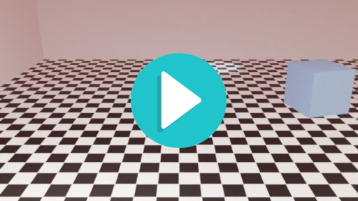

# Wallermax H1
[](docs/render.mp4)


> **⚠️ BETA PROTOTYPE — NOT PRODUCTION-READY**
>
> Wallermax H1 is a **beta prototype** of a **video generator based on 3D scene
> rendering**. It is an experimental project that demonstrates how a Large Language
> Model (LLM) can be used to translate a natural-language description — optionally
> accompanied by reference and look-dev images — into a fully procedural 3D
> animation rendered as an MP4 video.
>
> The core idea: **send all available context (prompt, images, render settings) to
> an LLM via its API, receive a structured JSON "World Model" that describes every
> object, light, camera and event in the scene, then feed that JSON to a Python
> script that drives Blender (or any other 3D modeling application with a Python
> API) to produce the animation.**


---

## How it works

```
User (web UI or CLI)
  │
  │  prompt + optional reference image + optional final/look-dev image
  │  + render settings (resolution, fps, duration, engine)
  ▼
┌─────────────────────────────────────────────────────┐
│  Wallermax H1 server  (Node.js + TypeScript)        │
│                                                      │
│  1. Reconstruction analyzer (if ref image)           │
│     → LLM call → structured 3D hypothesis             │
│                                                      │
│  2. Final-image analyzer (if final image)            │
│     → LLM call → camera/lighting/palette/texture     │
│                                                      │
│  3. Scene compiler (always)                          │
│     → LLM call → World Model JSON                    │
│       (entities, lights, camera, materials,          │
│        physics, events, aesthetic)                   │
│                                                      │
│  4. Renderer                                         │
│     → Blender (Python/bpy) renders PNG frames        │
│     → ffmpeg encodes frames → H.264 MP4              │
│     OR                                                │
│     → Fallback renderer (PIL + ffmpeg) → preview MP4 │
└─────────────────────────────────────────────────────┘
  │
  ▼
  render.mp4 (H.264, browser-playable)
  world.blend (Blender scene file)
  world.json (World Model)
  scene_report.md (human-readable summary)
  reconstruction.json (reference-image analysis)
  final_image.json (look-dev analysis)
```

The LLM never writes Python or mesh data. It only produces a **declarative
World Model** — a JSON document that describes *what* the scene contains
(rooms, objects, lights, camera) and *how* it should animate (events,
behaviors, keyframes). The Python script (`build_scene.py`) then compiles
that description into actual Blender operations.

---

## Features

### LLM-driven scene generation

- **Three LLM providers** with a unified interface:
  - **`mock`** — returns a canned World Model for testing without an API key.
    Parses basic color words from the prompt (e.g. "green ball" → green ball).
  - **`openai`** — uses OpenAI's Chat Completions API with JSON-mode response
    format. Supports GPT-4o, GPT-4o-mini and any OpenAI-compatible model.
  - **`zai`** — uses the Z.ai web-dev SDK. Works inside the Z.ai sandbox without
    an API key.
- **Three analysis stages** (each is a separate LLM call):
  1. **Reconstruction** — infers the 3D scene from a reference image
     (rooms, objects, materials, lighting, camera, ambiguities).
  2. **Final-image analysis** — extracts the aesthetic "look-dev" from a
     target image (camera language, lighting mood, palette, textures, style).
  3. **Scene compilation** — combines the prompt + reconstruction + look-dev
     into a single World Model JSON.
- **Provenance tracking** — every entity in the World Model carries a
  `provenance` field (`observed`, `user_defined`, `inferred`, `creative`)
  and a `confidence` float. The system never silently turns a creative guess
  into a fact.
- **Automatic event rescaling** — if the LLM proposes a 10-second animation
  but the user requests 2 seconds, all event times and behavior durations are
  automatically rescaled to fit.

### Blender integration

- **Full 3D rendering** with EEVEE or Cycles (user-selectable).
- **Procedural geometry** — spheres, boxes, cylinders, planes, rooms — no
  external mesh assets required.
- **Materials** — Principled BSDF with base color, roughness, metallic, IOR,
  alpha, emission, and procedural patterns (checker, noise, gradient, brick).
  The checker scale is automatically computed from the plane size so cells
  are the correct physical size.
- **Lights** — point, area, sun and spot lights with power, color, color
  temperature (Kelvin → RGB), size, beam angle and softness.
- **Camera** — perspective or orthographic, with lens, sensor width,
  depth-of-field (focus distance + f-stop), and target tracking.
- **Camera behaviors** — static, look_at, follow, orbit, dolly_in/out,
  crane_up/down, pan, tilt. Orbit uses a pivot empty with
  `matrix_parent_inverse` for correct world-space preservation.
- **Rigid-body physics** — mass, restitution, friction, active/passive types.
  The rigidbody world is created lazily if needed.
- **Keyframe animation** — events (position, rotation, energy, color,
  visibility changes) are keyframed with automatic frame-1 baselines for
  smooth interpolation.
- **Aesthetic compositor** — vignette, bloom, exposure EV applied via
  Blender's compositor nodes (with graceful fallback if the compositor
  is unavailable).
- **EEVEE performance tuning** — automatically sets TAA samples to 16,
  disables soft shadows, SSR, volumetric shadows and bloom for faster
  preview renders.
- **Cross-version compatibility** — the script detects and adapts to
  Blender 3.x, 4.x and 5.x:
  - EEVEE vs. EEVEE_NEXT engine name.
  - `use_nodes` deprecation (uses data API fallback).
  - `Action.fcurves` vs. slotted-actions `layers[].strips[].channelbag.fcurves`.
  - `bpy.ops` vs. data API for empty creation, shade_smooth, etc.
  - `rigidbody_world` lazy creation.
  - `animation_data_create()` before keyframe_insert (Blender 5.x).

### Fallback preview renderer

When Blender is not installed (or fails to start), the pipeline automatically
falls back to a **Python + Pillow + ffmpeg** renderer that produces a
top-down schematic preview:

- Renders the room as a checkerboard floor with walls outline.
- Draws entities as colored 2D icons (disk, box, cylinder) at their X, Y
  positions.
- Lights are drawn as colored radial glows (power → radius, color → tint).
- Camera is drawn as a small triangle.
- Animated events (position, energy changes) are keyframed over time.
- Aesthetic post-processing (vignette, grain, exposure) is applied.
- Output is an H.264 MP4 encoded with ffmpeg.
- The fallback renderer is **deterministic** — same inputs always produce
  the same outputs.

### Video encoding

- **Automatic encoder selection** with probe-and-test:
  - Tries `libx264` (software H.264) → `h264_qsv` (Intel QuickSync) →
    `h264_amf` (AMD) → `h264_nvenc` (NVIDIA) → `libx265` (HEVC) → `mpeg4`.
  - Each encoder is **tested with a 1-frame encode** before being used for
    the full sequence. If the test fails (e.g. `h264_nvenc` without an NVIDIA
    GPU), the next encoder is tried automatically.
  - All encoders include `-movflags +faststart` for progressive streaming.
- **Blender's bundled ffmpeg** is preferred over the system ffmpeg — it
  always has `libx264` and is found next to the Blender executable.
- **Range request support** — the HTTP server supports `Range: bytes=...`
  so the browser can stream and seek the MP4 without downloading it entirely.
- **No `Content-Disposition: attachment`** for video files — the browser
  plays them inline in the `<video>` element.

### Web UI

- **Single-page dark-mode UI** built with vanilla HTML/CSS/JS (no React,
  no Next.js, no bundler).
- **Prompt textarea** with a default example prompt.
- **Two image dropzones** — reference image (for reconstruction) and
  final image (for look-dev), with drag-and-drop support.
- **Render settings** — width, height, fps, duration, engine (EEVEE/Cycles),
    Cycles samples, LLM provider selection.
- **Mock provider warning** — a visible amber banner when the mock provider
  is active, explaining that the prompt will be ignored.
- **Live progress bar** with SSE (Server-Sent Events) updates.
- **Frame counter** — shows `34/96` (current frame / total frames) in
  real time next to the "Pipeline" title.
- **Stop Pipeline button** — the "Run Pipeline" button transforms into a
  red "Stop Pipeline" button while a job is running. Clicking it sends a
  `SIGTERM` to the Blender/Python process, aborting the render.
- **Six tabs** in the output panel:
  - **World Model** — pretty-printed JSON of the generated scene.
  - **Reconstruction** — pretty-printed reference-image analysis JSON.
  - **Final Image** — pretty-printed look-dev analysis JSON.
  - **Report** — the generated `scene_report.md`.
  - **Render** — HTML5 `<video>` player with download links and a badge
    showing which renderer was used (Blender or fallback).
  - **Logs** — real-time renderer log output (Blender / fallback), with
    auto-scroll to the latest line.
  - **Jobs** — table of the last 25 jobs with "open" buttons to reload
    their outputs.
- **Renderer badge** — green "Rendered with Blender (full 3D)" or amber
  "Rendered with fallback preview (Blender not installed)".
- **Python check** button — opens `/api/python-check` showing which Python
  interpreters the server can find, their paths, and whether Pillow /
  ffmpeg are available.
- **Health check** button — shows server status.

### HTTP API

| Method | Path | Description |
|--------|------|-------------|
| `GET` | `/api/health` | Server health + current config |
| `GET` | `/api/config` | Default render settings + provider |
| `GET` | `/api/python-check` | Diagnostic: which Python interpreters are available |
| `POST` | `/api/pipeline` | Submit a full pipeline (multipart/form-data with images) |
| `POST` | `/api/pipeline-sync` | Submit a pipeline (JSON body, no images) |
| `POST` | `/api/analyze` | Analyze a single final image only |
| `GET` | `/api/jobs` | List all known jobs |
| `GET` | `/api/jobs/:id` | Get a job's progress snapshot |
| `GET` | `/api/jobs/:id/events` | SSE stream of progress updates |
| `POST` | `/api/jobs/:id/abort` | Abort a running job (kills the Blender/Python process) |
| `GET` | `/api/files/:jobId/*name` | Download an artifact (with Range support for MP4s) |
| `GET` | `/api/download/:jobId/*name` | Alias of `/api/files` |
| `GET` | `/static/*path` | Static assets (UI HTML/CSS/JS) |
| `GET` | `/download/*path` | Files in the project `download/` directory |

### CLI

```bash
npm run cli -- --prompt <file> [--image <file>] [--final <file>]
                       [--provider mock|openai|zai] [--model <name>]
                       [--skip-blender] [--out <dir>]
                       [--width 640] [--height 360] [--fps 24] [--duration 2]
                       [--engine BLENDER_EEVEE_NEXT|CYCLES] [--samples 16]
```

The CLI uses the exact same renderer abstraction as the web server: tries
Blender first, falls back to the preview renderer if Blender is not installed.

### Configuration

All configuration is read from a `.env` file at the project root:

| Variable | Default | Description |
|----------|---------|-------------|
| `PORT` | `4317` | TCP port for the HTTP server |
| `HOST` | `127.0.0.1` | Bind address |
| `LLM_PROVIDER` | `mock` | `mock` / `openai` / `zai` |
| `OPENAI_API_KEY` | — | Required when `LLM_PROVIDER=openai` |
| `OPENAI_MODEL` | `gpt-4o-mini` | OpenAI model name |
| `ZAI_API_KEY` | — | Optional outside the Z.ai sandbox |
| `BLENDER_BIN` | `blender` | Path to the Blender executable |
| `SKIP_BLENDER` | `0` | `1` to never invoke Blender |
| `PYTHON_BIN` | `python3` | Python interpreter for the fallback renderer |
| `DEFAULT_RENDER_*` | `640×360 @ 24 fps × 2 s` | Defaults shown in the UI |
| `MAX_UPLOAD_BYTES` | `20971520` (20 MiB) | Per-image upload cap |
| `WALLERMAX_USER` / `WALLERMAX_PASS` | — | Optional basic-auth |

### Architecture

```
server/src/
├── index.ts              # HTTP server entry
├── router.ts             # Route dispatcher (supports :param and *splat)
├── config.ts             # .env loader (singleton config)
├── types.ts              # Shared TypeScript types
├── util.ts               # safeJoin, mimeFromExt, sendJson, readBody
├── jobs.ts               # In-memory job store + SSE + abort support
├── pipeline.ts           # Orchestrates: analyze → compile → render
├── renderer.ts           # Renderer abstraction (Blender + fallback + probe)
├── cli.ts                # CLI entry point
├── llm/
│   ├── index.ts          # Provider factory
│   ├── provider.ts       # Interface + extractJson() + runPythonCode()
│   ├── prompts.ts        # System prompts (scene compiler, reconstruction, final-image)
│   ├── openai.ts         # OpenAI provider (Chat Completions JSON-mode)
│   ├── zai.ts            # ZAI provider (z-ai-web-dev-sdk)
│   └── mock.ts           # Mock provider with color parsing
├── analyzers/
│   ├── schemas.ts        # JSON schema loader
│   ├── scene.ts          # Unified scene analyzer (prompt + ref + final)
│   └── finalImage.ts     # Standalone final-image analyzer
└── handlers/
    ├── index.ts          # All HTTP route handlers
    └── multipart.ts      # Formidable wrapper for file uploads

python/
├── build_scene.py        # Full Blender compiler (1500+ lines)
├── fallback_renderer.py  # PIL + ffmpeg preview renderer
└── diagnose_video_api.py # Diagnostic script for Blender's video API

schemas/
├── world_model.schema.json      # World Model JSON schema
├── reconstruction.schema.json   # Reference-image reconstruction schema
└── final_image.schema.json      # Final-image look-dev schema

public/
├── index.html            # Single-page UI
├── styles.css            # Dark-mode theme
└── app.js                # UI controller (SSE, tabs, drag-drop, stop)

prompts/
├── example.txt                  # Text-only example
├── reconstruction_example.txt   # Image + prompt example
└── cinematic_dusk.txt           # Cinematic look-dev example
```

### Known limitations

1. **Blender 5.2 video output** — the `FFMPEG` enum value is listed in
   `image_settings.file_format` but cannot be assigned from Python (raises
   `TypeError`). This is a bug in Blender 5.2 LTS. The workaround is to
   render PNG frames and encode them with ffmpeg externally — this is the
   standard industry approach and works reliably.

2. **Blender 5.2 `scene.render.outputs`** — this API (introduced in 5.0/5.1)
   does not exist in the 5.2 LTS build. The diagnostic script
   (`python/diagnose_video_api.py`) confirms this.

3. **Single-image reconstruction** — the reconstruction analyzer works with
   one reference image. Multi-view reconstruction is not supported.

4. **Mock provider ignores the prompt** — the mock provider always returns
   a ball-in-checkerboard-room scene. It only parses basic color words
   ("green ball", "blue box"). For real prompt-driven scene generation,
   use the `openai` or `zai` provider.

5. **Ball animation** — in Blender 5.2, `keyframe_insert()` creates an
   Action but may not automatically bind it to the object's
   `animation_data.action`. The script includes a `_verify_action_binding()`
   function that detects and fixes this, but some Blender builds may still
   not evaluate the animation during render. This is being investigated.

6. **No persistence** — jobs are in-memory. Restarting the server clears
   them. Artifacts (world.json, render.mp4, etc.) live on disk under
   `.wallermax/<jobId>/` until the workdir is cleaned.

### Quick start

```bash
# Install
cd wallermax-h1
npm install
cp .env.example .env

# Start the dev server
npm run dev

# Open http://127.0.0.1:4317/ in your browser
```

For real LLM-driven scene generation, edit `.env`:
```bash
LLM_PROVIDER=openai
OPENAI_API_KEY=sk-your-key-here
OPENAI_MODEL=gpt-4o-mini
```

### License

MIT.
